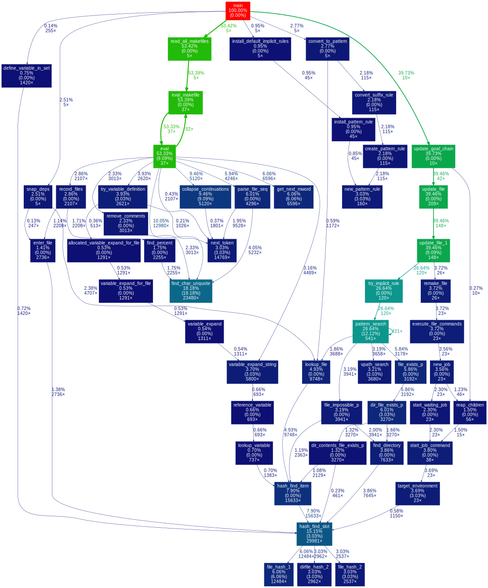
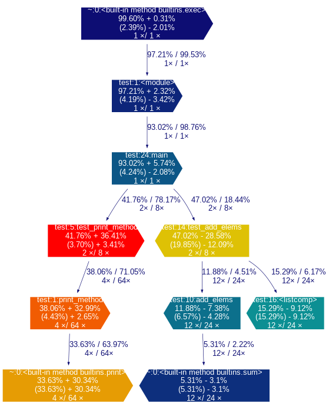

# About _gprof2dot_

This is a Python script to convert the output from many profilers into a [dot graph](https://www.graphviz.org/doc/info/lang.html).

It can:

  * read output from:
    * [Linux perf](https://perf.wiki.kernel.org/)
    * [Valgrind's callgrind tool](https://valgrind.org/docs/manual/cl-manual.html)
    * [OProfile](https://oprofile.sourceforge.net/)
    * [Sysprof](http://www.sysprof.com/)
    * [Xperf](https://learn.microsoft.com/en-us/windows-hardware/test/wpt/)
    * [VTune](https://www.intel.com/content/www/us/en/developer/tools/oneapi/vtune-profiler.html)
    * [Very Sleepy](https://www.codersnotes.com/sleepy/)
    * [Python profilers](https://docs.python.org/3/library/profile.html#profile-stats)
    * [Java's HPROF](https://docs.oracle.com/javase/7/docs/technotes/samples/hprof.html)
    * prof, [gprof](https://sourceware.org/binutils/docs/gprof/)
    * [DTrace](https://en.wikipedia.org/wiki/DTrace)
    * stackcollapse from [FlameGraph](https://github.com/brendangregg/FlameGraph)
  * prune nodes and edges below a certain threshold;
  * use an heuristic to propagate time inside mutually recursive functions;
  * use color efficiently to draw attention to hot-spots;
  * work on any platform where Python and Graphviz is available, i.e, virtually anywhere;
  * compare two graphs with almost identical structures for the analysis of performance metrics such as time or function calls.

**If you want an interactive viewer for the graphs generated by _gprof2dot_, check [xdot.py](https://github.com/jrfonseca/xdot.py).**


# Status

_gprof2dot_ currently fulfills my needs, and I have little or no time for its
maintenance.  So I'm afraid that any requested features are unlikely to be
implemented, and I might be slow processing issue reports or pull requests.

[](https://github.com/jrfonseca/gprof2dot/actions/workflows/build.yml)
[](https://codecov.io/gh/jrfonseca/gprof2dot)


# Example

This is the result from the [example data](https://linuxgazette.net/100/misc/vinayak/overall-profile.txt) in the [Linux Gazette article](https://linuxgazette.net/100/vinayak.html) with the default settings:



# Requirements

  * [Python](https://www.python.org/download/): known to work with version >=3.8; it will most likely _not_ work with earlier releases.
  * [Graphviz](https://www.graphviz.org/Download.php): tested with version 2.26.3, but should work fine with other versions.

## Windows users

  * Download and install [Python for Windows](https://www.python.org/download/)
  * Download and install [Graphviz for Windows](https://www.graphviz.org/Download_windows.php)

## Linux users

On Debian/Ubuntu run:

    apt-get install python3 graphviz

On RedHat/Fedora run

    yum install python3 graphviz


# Download

  * [PyPI](https://pypi.python.org/pypi/gprof2dot/)

        pip install gprof2dot

  * [Standalone script](https://raw.githubusercontent.com/jrfonseca/gprof2dot/master/gprof2dot.py)

  * [Git repository](https://github.com/jrfonseca/gprof2dot)


# Documentation

## Usage

```
Usage: 
	gprof2dot.py [options] [file] ...

Options:
  -h, --help            show this help message and exit
  -o FILE, --output=FILE
                        output filename [stdout]
  -n PERCENTAGE, --node-thres=PERCENTAGE
                        eliminate nodes below this threshold [default: 0.5]
  -e PERCENTAGE, --edge-thres=PERCENTAGE
                        eliminate edges below this threshold [default: 0.1]
  -f FORMAT, --format=FORMAT
                        profile format: axe, callgrind, collapse, dtrace,
                        hprof, json, oprofile, perf, prof, pstats, sleepy,
                        sysprof or xperf [default: prof]
  --total=TOTALMETHOD   preferred method of calculating total time: callratios
                        or callstacks (currently affects only perf format)
                        [default: callratios]
  -c THEME, --colormap=THEME
                        color map: bw, color, gray, pink or print [default:
                        color]
  -s, --strip           strip function parameters, template parameters, and
                        const modifiers from demangled C++ function names
  --color-nodes-by-selftime
                        color nodes by self time, rather than by total time
                        (sum of self and descendants)
  -w, --wrap            wrap function names
  --show-samples        show function samples
  --node-label=MEASURE  measurements to on show the node (can be specified
                        multiple times): self-time, self-time-percentage,
                        total-time or total-time-percentage [default: total-
                        time-percentage, self-time-percentage]
  --list-functions=LIST_FUNCTIONS
                        list functions available for selection in -z or -l,
                        requires selector argument ( use '+' to select all).
                        Recall that the selector argument is used with
                        Unix/Bash globbing/pattern matching, and that entries
                        are formatted '<pkg>:<linenum>:<function>'. When
                        argument starts with '%', a dump of all available
                        information is performed for selected entries,  after
                        removal of leading '%'.
  -z ROOT, --root=ROOT  prune call graph to show only descendants of specified
                        root function
  -l LEAF, --leaf=LEAF  prune call graph to show only ancestors of specified
                        leaf function
  --depth=DEPTH         prune call graph to show only descendants or ancestors
                        until specified depth
  --skew=THEME_SKEW     skew the colorization curve.  Values < 1.0 give more
                        variety to lower percentages.  Values > 1.0 give less
                        variety to lower percentages
  -p FILTER_PATHS, --path=FILTER_PATHS
                       Filter all modules not in a specified path
  --compare             Compare two graphs with almost identical structure. With this
                        option two files should be provided.gprof2dot.py
                        [options] --compare [file1] [file2] ...
  --compare-tolerance=TOLERANCE
                        Tolerance threshold for node difference
                        (default=0.001%).If the difference is below this value
                        the nodes are considered identical.
  --compare-only-slower
                        Display comparison only for function which are slower
                        in second graph.
  --compare-only-faster
                        Display comparison only for function which are faster
                        in second graph.
  --compare-color-by-difference
                        Color nodes based on the value of the difference.
                        Nodes with the largest differences represent the hot
                        spots.
```

## Examples

### Linux perf

    perf record -g -- /path/to/your/executable
    perf script | c++filt | gprof2dot.py -f perf | dot -Tpng -o output.png

### oprofile

    opcontrol --callgraph=16
    opcontrol --start
    /path/to/your/executable arg1 arg2
    opcontrol --stop
    opcontrol --dump
    opreport -cgf | gprof2dot.py -f oprofile | dot -Tpng -o output.png

### xperf

If you're not familiar with xperf then read [this excellent article](https://blogs.msdn.com/b/pigscanfly/archive/2009/08/06/stack-walking-in-xperf.aspx) first. Then do:

  * Start xperf as

        xperf -on Latency -stackwalk profile

  * Run your application.

  * Save the data.
`
        xperf -d output.etl

  * Start the visualizer:

        xperf output.etl

  * In _Trace_ menu, select _Load Symbols_. _Configure Symbol Paths_ if necessary.

  * Select an area of interest on the _CPU sampling graph_, right-click, and select _Summary Table_.

  * In the _Columns_ menu, make sure the _Stack_ column is enabled and visible.

  * Right click on a row, choose _Export Full Table_, and save to _output.csv_.

  * Then invoke gprof2dot as

        gprof2dot.py -f xperf output.csv | dot -Tpng -o output.png

### VTune Amplifier XE

  * Collect profile data as (also can be done from GUI):

        amplxe-cl -collect hotspots -result-dir output -- your-app

  * Visualize profile data as:

        amplxe-cl -report gprof-cc -result-dir output -format text -report-output output.txt
        gprof2dot.py -f axe output.txt | dot -Tpng -o output.png

See also [Kirill Rogozhin's blog post](http://web.archive.org/web/20130506045856/http://software.intel.com:80/en-us/blogs/2013/04/05/making-visualized-call-graph-from-intel-vtune-amplifier-xe-results).

### gprof

    /path/to/your/executable arg1 arg2
    gprof path/to/your/executable | gprof2dot.py | dot -Tpng -o output.png

### python profile

    python -m profile -o output.pstats path/to/your/script arg1 arg2
    gprof2dot.py -f pstats output.pstats | dot -Tpng -o output.png

### python cProfile (formerly known as lsprof)

    python -m cProfile -o output.pstats path/to/your/script arg1 arg2
    gprof2dot.py -f pstats output.pstats | dot -Tpng -o output.png

### Java HPROF

    java -agentlib:hprof=cpu=samples ...
    gprof2dot.py -f hprof java.hprof.txt | dot -Tpng -o output.png

See [Russell Power's blog post](http://web.archive.org/web/20220122110828/http://rjp.io/2012/07/03/java-profiling/) for details.

### DTrace

    dtrace -x ustackframes=100 -n 'profile-97 /pid == 12345/ { @[ustack()] = count(); } tick-60s { exit(0); }' -o out.user_stacks
    gprof2dot.py -f dtrace out.user_stacks | dot -Tpng -o output.png

    # Notice: sometimes, the dtrace outputs format may be latin-1, and gprof2dot will fail to parse it.
    # To solve this problem, you should use iconv to convert to UTF-8 explicitly.
    # TODO: add an encoding flag to tell gprof2dot how to decode the profile file.
    iconv -f ISO-8859-1 -t UTF-8 out.user_stacks | gprof2dot.py -f dtrace

### stackcollapse

Brendan Gregg's FlameGraph tool takes as its input a text file containing one
line per sample. This format can be generated from various other inputs using
the `stackcollapse` scripts in the [FlameGraph
repository](https://github.com/brendangregg/FlameGraph). It can also be
generated by tools such as [py-spy](https://github.com/benfred/py-spy).

Example usage:

  * Perf

        perf record -g -- /path/to/your/executable
        perf script | FlameGraph/stackcollapse-perf.pl > out.collapse
        gprof2dot.py -f collapse out.collapse | dot -Tpng -o output.png

  * Py-spy

        py-spy record -p <pidfile> -f raw -o out.collapse
        gprof2dot.py -f collapse out.collapse | dot -Tpng -o output.png

## Compare Example

This image illustrates an example usage of the `--compare` and `--compare-color-by-difference` options.



Arrow pointing to the right indicate node where the function performed faster
in the profile provided as the second one (second profile), while arrow
pointing to the left indicate node where the function was faster in the profile
provided as the first one (first profile).

### Node

    +-----------------------------+
    |        function name          \
    | total time %  -/+ total_diff   \
    | ( self time % ) -/+ self_diff  /
    | total calls1 / total calls2   /
    +-----------------------------+

Where
- `total time %` and `self time %` come from the first profile
- `diff` is calculated as the absolute value of `time in the first profile - time in the second profile`.

> **Note** The compare option has been tested for pstats, axe and callgrind profiles.

## Output

A node in the output graph represents a function and has the following layout:

    +------------------------------+
    |        function name         |
    | total time % ( self time % ) |
    |         total calls          |
    +------------------------------+

where:

  * _total time %_ is the percentage of the running time spent in this function and all its children;
  * _self time %_ is the percentage of the running time spent in this function alone;
  * _total calls_ is the total number of times this function was called (including recursive calls).

An edge represents the calls between two functions and has the following layout:

               total time %
                  calls
    parent --------------------> children

Where:

  * _total time %_ is the percentage of the running time transferred from the children to this parent (if available);
  * _calls_ is the number of calls the parent function called the children.

Note that in recursive cycles, the _total time %_ in the node is the same for the whole functions in the cycle, and there is no _total time %_ figure in the edges inside the cycle, since such figure would make no sense.

The color of the nodes and edges varies according to the _total time %_ value. In the default _temperature-like_ color-map, functions where most time is spent (hot-spots) are marked as saturated red, and functions where little time is spent are marked as dark blue. Note that functions where negligible or no time is spent do not appear in the graph by default.

## Listing functions

The flag `--list-functions` permits listing the function entries found in the `gprof` input.
This is intended as a tool to prepare for utilisations with the `--leaf` (`-l`) 
or `--root` (`-z`) flags.

  ~~~
  prof2dot.py -f pstats /tmp/myLog.profile  --list-functions "test_segments:*:*" 
    
  test_segments:5:<module>,
  test_segments:206:TestSegments,
  test_segments:46:<lambda>
  ~~~

  - The selector argument is used with Unix/Bash globbing/pattern matching, in the same
    fashion as performed by the `-l` and `-z` flags.
	  
  - Entries are formatted '\<pkg\>:\<linenum\>:\<function\>'. 
	
  - When selector argument starts with '%', a dump of all available information is 
	performed for selected entries,   after removal of selector's leading '%'. If 
	selector is "+" or "*", the full list of functions is printed.


## Frequently Asked Questions

### How can I generate a complete call graph?

By default `gprof2dot.py` generates a _partial_ call graph, excluding nodes and edges with little or no impact in the total computation time. If you want the full call graph then set a zero threshold for nodes and edges via the `-n` / `--node-thres`  and `-e` / `--edge-thres` options, as:

    gprof2dot.py -n0 -e0

### The node labels are too wide. How can I narrow them?

The node labels can get very wide when profiling C++ code, due to inclusion of scope, function arguments, and template arguments in demangled C++ function names.

If you do not need function and template arguments information, then pass the `-s` / `--strip` option to strip them.

If you want to keep all that information, or if the labels are still too wide, then you can pass the `-w` / `--wrap`, to wrap the labels. Note that because `dot` does not wrap labels automatically the label margins will not be perfectly aligned.

### Why there is no output, or it is all in the same color?

Likely, the total execution time is too short, so there is not enough precision in the profile to determine where time is being spent.

You can still force displaying the whole graph by setting a zero threshold for nodes and edges via the `-n` / `--node-thres`  and `-e` / `--edge-thres` options, as:

    gprof2dot.py -n0 -e0

But to get meaningful results you will need to find a way to run the program for a longer time period (aggregate results from multiple runs).

### Why don't the percentages add up?

You likely have an execution time too short, causing the round-off errors to be large.

See question above for ways to increase execution time.

### Which options should I pass to gcc when compiling for profiling?

Options which are _essential_ to produce suitable results are:

  * **`-g`** : produce debugging information
  * **`-fno-omit-frame-pointer`** : use the frame pointer (frame pointer usage is disabled by default in some architectures like x86\_64 and for some optimization levels; it is impossible to walk the call stack without it)

_If_ you're using gprof you will also need `-pg` option, but nowadays you can get much better results with other profiling tools, most of which require no special code instrumentation when compiling.

You want the code you are profiling to be as close as possible as the code that you will
be releasing. So you _should_ include all options that you use in your release code, typically:

  * **`-O2`** : optimizations that do not involve a space-speed tradeoff
  * **`-DNDEBUG`** : disable debugging code in the standard library (such as the assert macro)

However many of the optimizations performed by gcc interfere with the accuracy/granularity of the profiling results.  You _should_ pass these options to disable those particular optimizations:

  * **`-fno-inline-functions`** : do not inline functions into their parents (otherwise the time spent on these functions will be attributed to the caller)
  * **`-fno-inline-functions-called-once`** : similar to above
  * **`-fno-optimize-sibling-calls`** : do not optimize sibling and tail recursive calls (otherwise tail calls may be attributed to the parent function)

If the granularity is still too low, you _may_ pass these options to achieve finer granularity:

  * **`-fno-default-inline`** : do not make member functions inline by default merely because they are defined inside the class scope
  * **`-fno-inline`** : do not pay attention to the inline keyword
Note however that with these last options the timings of functions called many times will be distorted due to the function call overhead. This is particularly true for typical C++ code which _expects_ that these optimizations to be done for decent performance.

See the [full list of gcc optimization options](https://gcc.gnu.org/onlinedocs/gcc/Optimize-Options.html) for more information.

# Links

See the [wiki](https://github.com/jrfonseca/gprof2dot/wiki) for external resources, including complementary/alternative tools.
